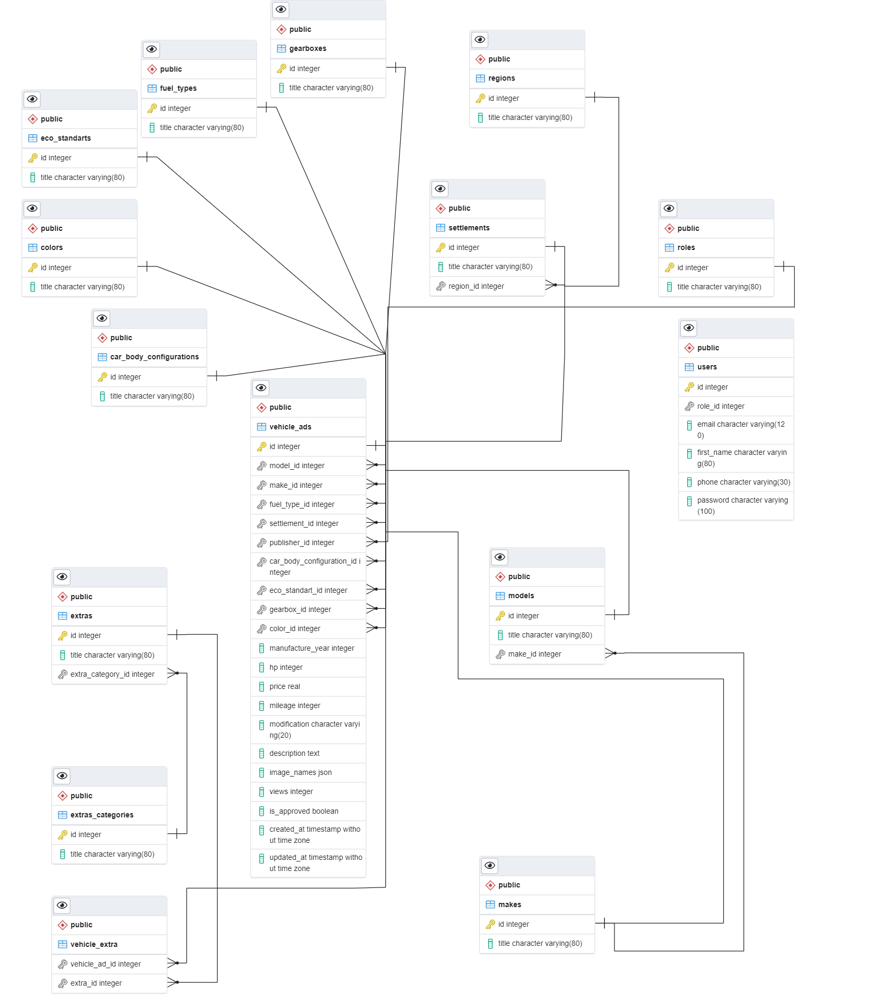

# Cars Marketplace

Simple web application using Python & Flask in the backend, TypeScript & React in the frontend and docker.

---------------------------------------------


## Installation
- Create .env file with the same content as .env.example:
```
cp .env.example .env
```
- If deploying in production edit the .env file to set different passwords (also change the corresponding values in `db/create_test_db.sql`).

- Install docker (or just Docker Desktop if you want) depending on your os.

- Build & start containers (it's going to take a while pulling all images) by running the following command:
```
docker-compose up
```
- Wait until command finishes. You should see the following output when it's completed:
```
..........................................
Finished building. Server is up
..........................................
```

---------------------------------------------

## Preview the app

Visit the following URL: `http://localhost:80`. 

Make sure the port is not taken by some other app. Change port if needed.

---------------------------------------------

## Frontend Development

In order for changes to take effect you need to run the npm watcher:

- Open the python_server container (by default the location is /var/www/web_app)

- Execute the command `cd assets/js` to get to the folder which contains all files frontend development

- Execute the command `npm run watch`

- Edit any js/scss files to preview changes

- Let the command window open so the watcher detects changes during development

---------------------------------------------

## Containers Usage

### python_server
Contains backend (Python) and frontend (React + TypeScript) logic. You can do the actions in CLI such as:
- Run npm watcher (see the frontend development section)
- View or modify the apache error log (`/var/log/apache2/error.log`):
    - To view the file contents:
        - `cat /var/log/apache2/error.log`
    - To view or edit content you can use the installed nano editor or vim:
        - `nano /var/log/apache2/error.log`
    - Truncate content:
        - `truncate -s 0 /var/log/apache2/error.log`

### postgre_db
Container serving as a relational database. You can connect to the app database by doing the following:
- Open the container in CLI
- Execute `psql --host=postgres --username=$POSTGRES_USER --dbname=$POSTGRES_DB`
- Enter the db password corresponding to the DB_PASSWORD variable in the .env file. It's `SAMPLE_PASSWORD` by default
- Afterwards you can execute any PostgreSQL command such as ` select * from users;`

To connect to the test database perform the following commands:
- Open the container in CLI
- Executing `psql --host=postgres --username=$DB_USER_TEST --dbname=$DB_NAME_TEST`
- Enter the test db password corresponding to the DB_PASSWORD_TEST variable in the .env file. It's `test_db_common` by default
- Afterwards you can execute any PostgreSQL command such as `select * from users;`

### redis_db
Container serving as a redis database used for caching. You can connect to the app database by doing the following:
- Open the container in CLI by executing this command: `redis-cli`
- To authorize perform the following command: `AUTH <redis_password>`. Replace `<redis_password>` with the value of the environment variable of `REDIS_PASSWORD` (example: `AUTH SAMPLE_REDIS_PASSWORD`)
- Afterwards you can execute any redis command such as `keys *`

To connect to the test database perform the following commands:
- Open the container in CLI by executing this command: `redis-cli`
- To authorize perform the following command: `AUTH <redis_password>`. Replace `<redis_password>` with the value of the environment variable of `REDIS_PASSWORD_TEST` (example: `AUTH SAMPLE_REDIS_PASSWORD_FOR_TESTS`)
- Afterwards you can execute any redis command such as `keys *`

---------------------------------------------

## Tests Running

In order to run tests execute the following command:
- Open the `python_server` container
- Execute the command `pytest` or `pytest -s` if you need to see logs from the `print` function

---------------------------------------------

## Flask commands

Flask commands are executed inside `python_server` container CLI.

- If you want to delete all tables and uploaded vehicle images use the following command: `flask drop-tables` inside `python_server`
- If you want to create all tables, insert fictive records and upload vehicle images use the following command: `flask seed`


## ERD - Entity Relationship Diagram
Indicates the attributes and relationship of the database tables:




## Backend development files:

- `Commands ` directory. Contains code for flask commands (example `flask seed`) and data needed for seeding
- `Decorators` directory. Contains functions that are meant to execute before certain endpoint and block access and further execution if needed. Such as accessing admin route by non admin user
- `Extensions` directory. Contains functions definition which makes it possible to execute code by simply calling a function in the template file
- `Forms` directory. Contains files which define what field the form has. It's used for request validation
-  `Helpers` directory. Contains functions which handle business data and can be used
outside services (examples: in models, repositories, services) unlike services which are supposed to be used only in views via dependency injection. It's also suitable for logic that is not meant to be used as a class
-  `Models` directory. Contains models representing tables, relations and records serialization. Tables with many to many relations are placed inside the `models/tables` directory
- `Repositories` directory. Contains files working with database layer by using the ORM library SQL Alchemy. There is one base class which is inherited by all repositories
- `Seeders` folder. Contains scripts that populates records in tables
- `Services` folder. Services perform business operations such as image processing and database operations using repository classes
- `Static` folder. Contains files that can be publicly accessed by anyone such as images and javascript bundle file
- `Templates` folder. Contains HTML templates files with template enjine processing operations such as loops and if statements
- `Tests` folder. Contains configuration, unit and functional tests
- `Views` folder. Contains files which define what python logic should be executed on certain endpoint.  Such files also use services through dependency injection
- `app.py` file. Defines flask app and database settings 
- `App.wsgi` file. Defines the starting point for execution of the Apache server
- `Requirements.txt` file. Defines libraries and their versions. They can be installed via `pip3`
- `Run.py` file.  Starting point of the app
- `.env.example` file. Contains environment variables with sample values. This file is supposed to be used for creating the `.env` file
- `.env` file. Contains environment variables and values. Unlike `.env.example` it's values are actually used by the application and are not just samples. This files is ignored by git for security reasons
`Apache2.conf` file. Defines settings for apache2 server
- `Docker-compose.yaml` file. Defines docker containers
- `Dockerfile` file. Defines instructions for building the `python_server` container
- `Entrypoint.sh` file. Defines instructions to execute after the `python_server` starts running. Such instructions is `npm install` since if we do it in `Dockerfile` node_modules folder will be deleted by volume mounting
